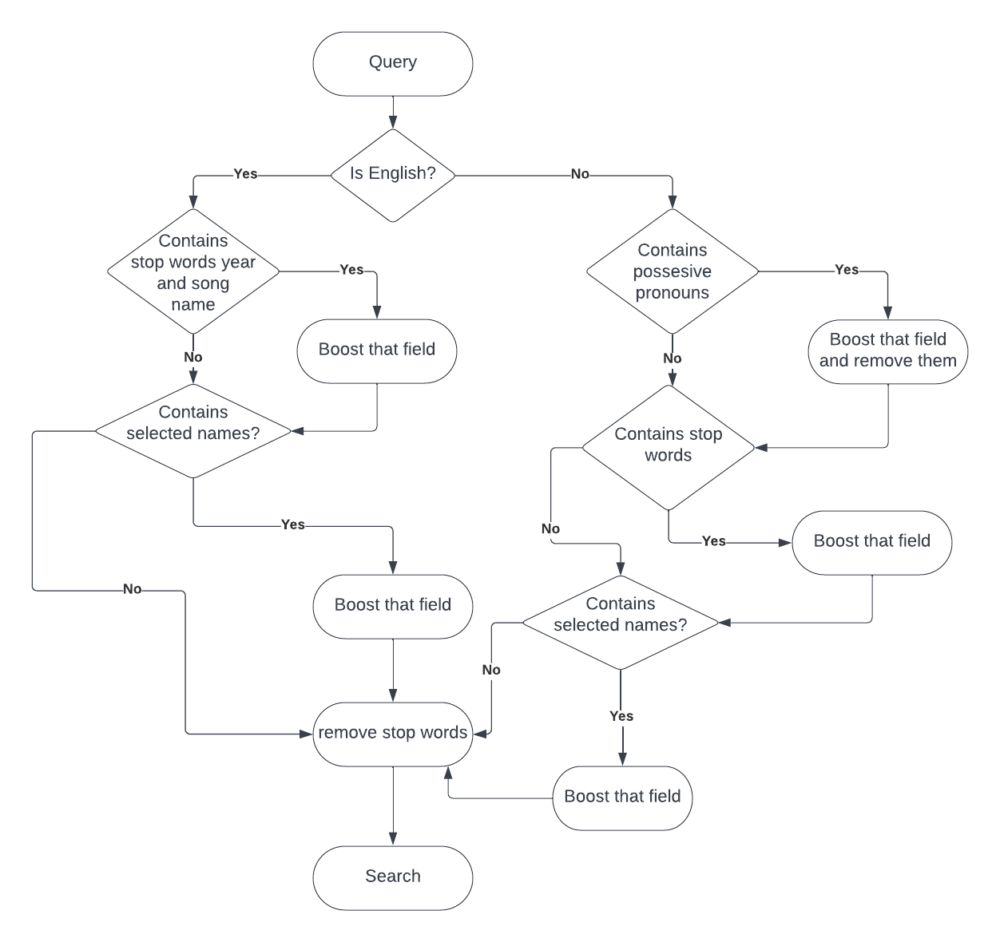

# Metaphor-based-Search-Engine-for-Sinhala-Songs
### Scope
This project consists of two phases. Building a text corpus of metaphors that are from 100 popular Sinhala songs in the 20th century is done in the first phase. In the second phase, a search application is developed to search Sinhala songs based on introduced queries. Elasticsearch is supposed to be used to develop the search application.

### Objective
The objective of this project is to provide a metaphor-based search application primarily targeting songwriters and students/undergraduates who learn Sinhala literature. With the use of this application, they can search Sinhala songs in the corpus primarily by metaphors or meanings of metaphors, to use in writing songs/studying.

### Use Case
Search Sinhala songs in the corpus based on 
- Metaphor
- Meaning of a metaphor
- Source domain
- Target domain
- Lyricist

### Corpus
- 100 popular Sinhala songs in the 20th century
- Attributes of a song: Song name, Song name in English letters, Lyricist, Artist, Year, Album
- Attributes of metaphor: Metaphor name, Source domain, Target domain, Meaning, Target domain in English, Meaning in English

### Analyzer of Sinhala Wordss
A custom analyzer with icu_tokenizer, custom ngam Filter and a custom stop word filter.

## Flow

## Demonstration Video

https://user-images.githubusercontent.com/62522608/213382739-0dfc1106-43d6-4855-b401-b19198e36336.mp4

### Youtube : https://www.youtube.com/watch?v=RX4VIya_688

